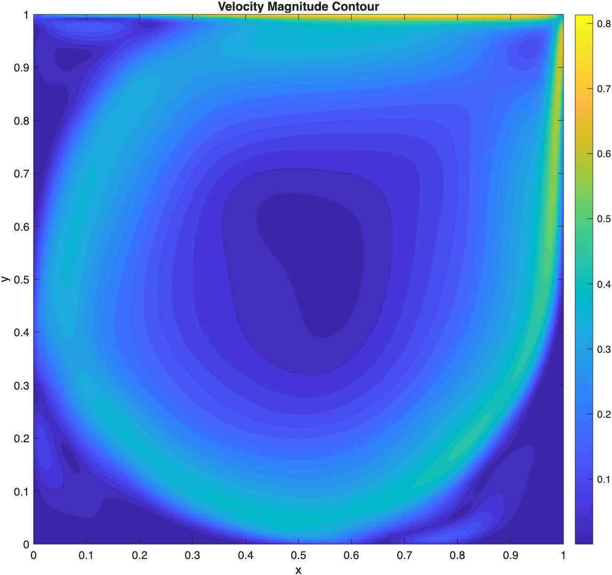
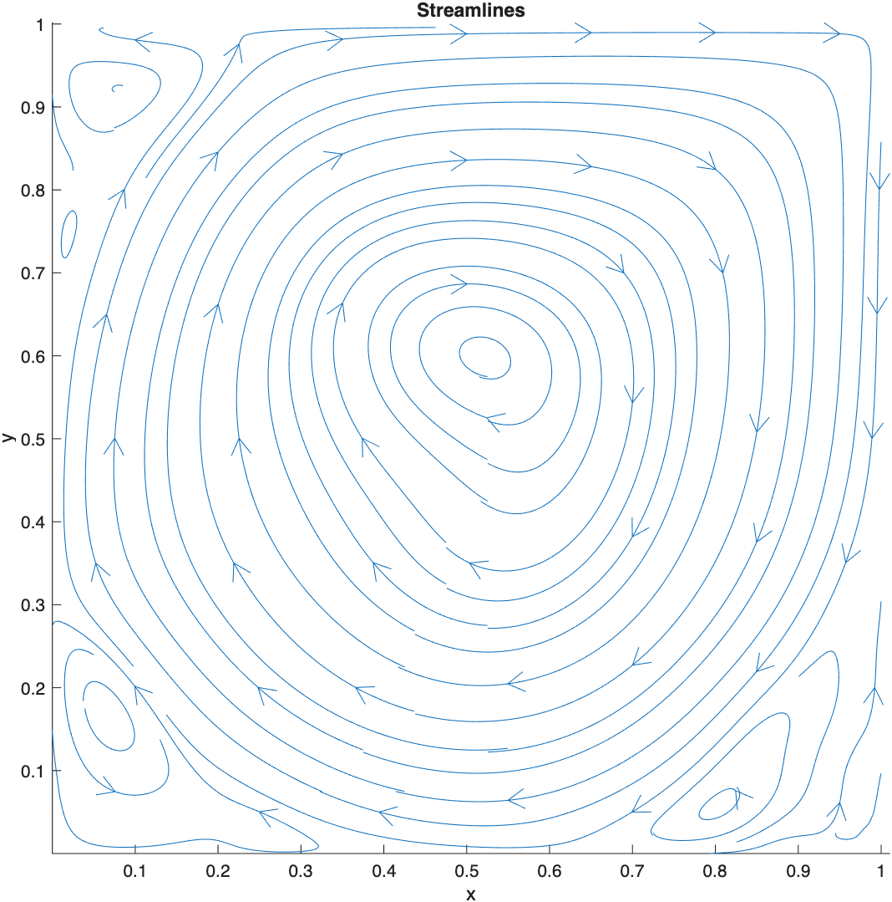
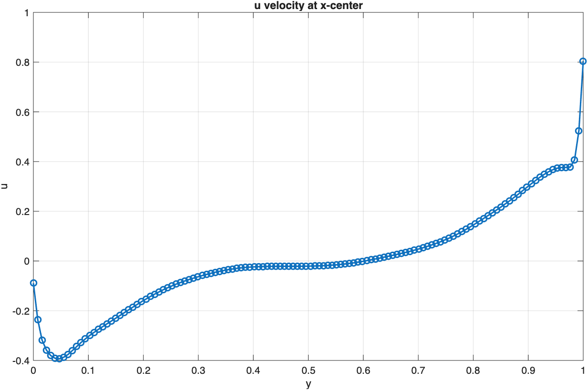
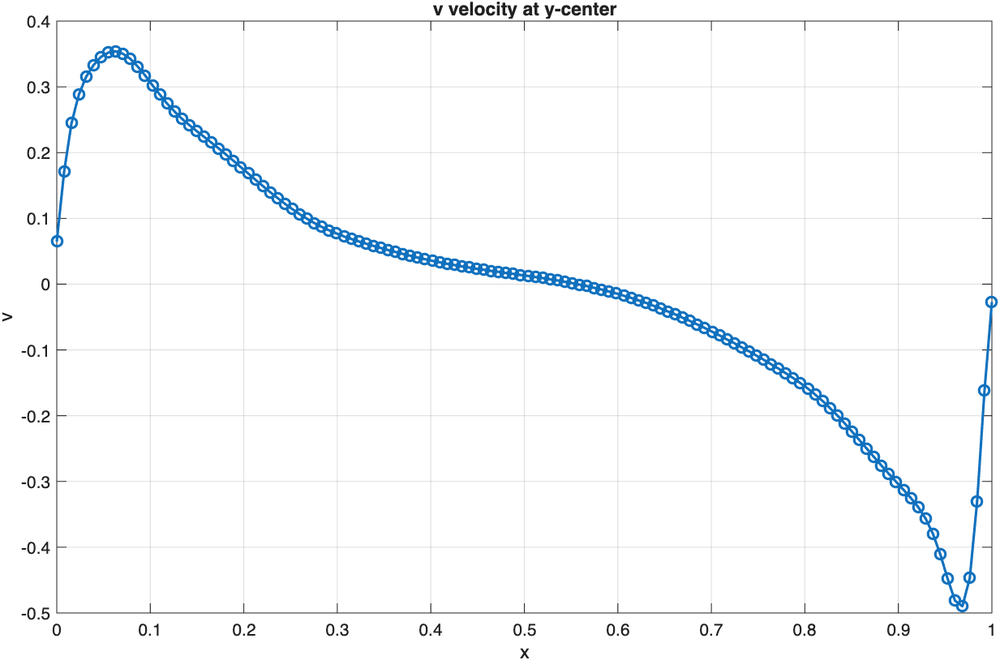

# Lid-Driven Cavity Flow - Semi-Implicit FVM Solver with Approximate Factorization (Crank-Nicolson Scheme)

---

## Table of Contents

1. [Abstract](#1-abstract)
2. [Domain and Boundary Conditions](#2-domain-and-boundary-conditions)
3. [Governing Equations — Incompressible Navier–Stokes (FVM Form)](#3-governing-equations--incompressible-navierstokes-fvm-form)
4. [Time Discretisation — Semi-Implicit Crank-Nicolson Scheme](#4-time-discretisation--semi-implicit-crank-nicolson-scheme)
5. [Why Approximate Factorization](#5-why-approximate-factorization)
6. [Directional Structure of the Discrete System](#6-directional-structure-of-the-discrete-system)
7. [The Factorization](#7-the-factorization)
8. [The Three-Stage, Four-Sweep Algorithm](#8-the-three-stage-four-sweep-algorithm)
9. [Tridiagonal Coefficients](#9-tridiagonal-coefficients)
10. [Pressure Poisson Equation and Velocity Correction](#10-pressure-poisson-equation-and-velocity-correction)
11. [Boundary Conditions and Ghost Cells](#11-boundary-conditions-and-ghost-cells)
12. [Time Step Constraint](#12-time-step-constraint)
13. [File Structure](#13-file-structure)
14. [Parameters](#14-parameters)
15. [Results](#15-results)

---

## 1. Abstract

A semi-implicit finite volume solver is developed for the 2D incompressible lid-driven cavity problem at elevated Reynolds numbers ($Re = 7500$), extending an earlier Implicit-Euler AF solver to a **Crank-Nicolson (CN)** treatment of diffusion, $\theta = 1/2$. The solver treats diffusion and linearized convection semi-implicitly in the predictor step, and — exactly as in the Euler variant — avoids assembling or inverting a large coupled sparse system at every step by employing **Approximate Factorization (AF)**, reducing the implicit solve to four scalar Thomas-algorithm tridiagonal passes per time step. Because Crank-Nicolson's implicit weight only carries $\theta=1/2$ (rather than Euler's $\theta=1$), the predictor is followed by an additional intermediate pressure pre-correction stage before projection, to keep the pressure-gradient treatment consistent with the CN time-centering. A pressure Poisson equation with Neumann boundary conditions is solved iteratively via Gauss–Seidel to enforce continuity and recover the corrected velocity field at each time step.

---

## 2. Domain and Boundary Conditions

$$x \in [0, 1], \quad y \in [0, 1]$$

A uniform Cartesian grid of $N_x \times N_x$ cells is used with ghost cells on all four sides. All variables ($u$, $v$, $P$) are collocated at cell centres.

**Boundary conditions:**

| Boundary         | $u$                   | $v$ |
| ---------------- | --------------------- | --- |
| Top (moving lid) | $U_{\text{lid}} = 1$  | $0$ |
| Bottom wall      | $0$                   | $0$ |
| Left wall        | $0$                   | $0$ |
| Right wall       | $0$                   | $0$ |

Ghost cell values enforce these conditions via anti-symmetric reflection for no-slip walls and linear extrapolation for the lid:

```
u_cell_cntr(1,:)   = 2*U_lid - u_cell_cntr(2,:)    ← lid (linear extrap)
u_cell_cntr(:,1)   = -u_cell_cntr(:,2)              ← left wall (anti-sym)
u_cell_cntr(end,:) = -u_cell_cntr(end-1,:)          ← bottom wall
u_cell_cntr(:,end) = -u_cell_cntr(:,end-1)          ← right wall
```

---

## 3. Governing Equations — Incompressible Navier–Stokes (FVM Form)

**x-momentum:**

$$\frac{\partial u}{\partial t} + \frac{\partial(u^2)}{\partial x} + \frac{\partial(uv)}{\partial y} = -\frac{\partial P}{\partial x} + \gamma \nabla^2 u$$

**y-momentum:**

$$\frac{\partial v}{\partial t} + \frac{\partial(uv)}{\partial x} + \frac{\partial(v^2)}{\partial y} = -\frac{\partial P}{\partial y} + \gamma \nabla^2 v$$

**Continuity:**

$$\frac{\partial u}{\partial x} + \frac{\partial v}{\partial y} = 0$$

where $\gamma = 1/Re$. In finite volume form, all flux terms are converted to face-sum integrals over each control volume via the divergence theorem.

---

## 4. Time Discretisation — Semi-Implicit Crank-Nicolson Scheme

Diffusion is advanced with the $\theta$-method:

$$\frac{u^{n+1}-u^n}{\Delta t} = \theta\,\gamma\nabla^2 u^{n+1} + (1-\theta)\,\gamma\nabla^2 u^n + (\text{explicit convection, pressure})$$

with **$\theta = 1/2$** (Crank-Nicolson) here, versus $\theta = 1$ (Implicit Euler) in the companion repository. Writing in **delta form**, $\Delta u = u^{n+1}-u^n$, and substituting $u^{n+1}=u^n+\Delta u$ into the diffusion terms:

$$\theta\,\gamma\nabla^2(u^n+\Delta u) + (1-\theta)\gamma\nabla^2 u^n = \theta\,\gamma\nabla^2\Delta u + \gamma\nabla^2 u^n$$

Note the explicit diffusion term retains **full weight** $\gamma\nabla^2 u^n$ regardless of $\theta$ — only the *implicit correction* $\theta\,\gamma\nabla^2\Delta u$ carries the $\theta$-weighting. This is why `RHS_u_mom.m`/`RHS_v_mom.m` are structurally unchanged from the Euler scheme (same convection + pressure + diffusion evaluated at time level $n$), while the tridiagonal coefficient functions (`coeff_*`) pick up an explicit factor of $\theta = 1/2$ that Euler's do not carry:

$$\frac{\Delta u}{\Delta t} + \theta\,(A_x + A_y)\Delta u = \text{RHS}_u, \qquad \theta = \frac12$$

$$\frac{\Delta v}{\Delta t} + \theta\,(A_x + A_y)\Delta v = \text{RHS}_v$$

$$\text{RHS}_u = \Delta t \cdot \frac{-C(u)^n - \nabla P^n + \gamma \nabla^2 u^n}{\Delta x \Delta y}, \qquad \text{RHS}_v = \Delta t \cdot \frac{-C(v)^n - \nabla P^n + \gamma \nabla^2 v^n}{\Delta x \Delta y} + (\text{cross-coupling})$$

**Implemented in:** `RHS_u_mom.m`, `RHS_v_mom.m` (unchanged in structure from the Euler scheme); `coeff_sides_u.m`, `coeff_sides_v.m`, `coeff_tb_u.m`, `coeff_tb_v.m` (carry the explicit $\theta=1/2$ weighting).

---

## 5. Why Approximate Factorization

Exactly as in the Euler variant, solving the delta-form system directly would require assembling and inverting a single $2N \times 2N$ coupled sparse block system every time step. AF avoids this by exploiting the **directional separability** of the structured FV stencil:

$$\left(\frac{I}{\Delta t} + \theta(A_x + A_y)\right)\mathbf{w} = \mathbf{R}$$

is approximated by the **factored product**:

$$\left(\frac{I}{\Delta t} + \theta A_x\right)\left(\frac{I}{\Delta t} + \theta A_y\right)\mathbf{w} = \mathbf{R}$$

Expanding introduces an extra cross term $\theta^2 A_x A_y \mathbf{w}$, coupling diagonal/corner neighbours $(l\pm1,m\pm1)$. Since $A_x, A_y = O(\Delta t)$ and $\mathbf{w}=O(\Delta t)$, this term is $O(\Delta t^3)$ per step regardless of $\theta$ — still **below the truncation floor** of the underlying scheme, so dropping it does not reduce formal accuracy. (Note: CN's own truncation error is $O(\Delta t^2)$ in time — one order better than Euler's $O(\Delta t)$ — so the AF factorization error is, if anything, *relatively* smaller against CN's baseline accuracy than against Euler's.)

---

## 6. Directional Structure of the Discrete System

Identical to the Euler variant — the triangularity property that makes AF work is a property of the *spatial* stencil and $u$-$v$ cross-coupling, not of the time-weighting $\theta$:

- Within $A_x$: the $u$-row has **no dependence on $\Delta v$** — the only $u$-$v$ coupling, $\partial(uv)/\partial y$, lives entirely in $A_y$.
- Within $A_y$: the $v$-row has **no dependence on $\Delta u$** — coupling $\partial(uv)/\partial x$ lives entirely in $A_x$.

So every $2\times2$ block inside $A_x$ is lower-triangular, every block inside $A_y$ is upper-triangular, and each directional sweep decomposes into **two independent scalar tridiagonal systems** regardless of $\theta$.

---

## 7. The Factorization

Writing $L_x = -\Delta t\,\theta\,A_x$, $L_y = -\Delta t\,\theta\,A_y$ (note the $\theta$ now sitting inside $L_x, L_y$, absent in the Euler repo's equivalent definitions), the exact system is:

$$(I - L_x - L_y)\mathbf{w} = \tilde{\mathbf{R}}$$

AF replaces this with the product form, solved via an intermediate field $\mathbf{w}^{\ast}$:

$$\text{Sweep 1: } (I - L_x)\mathbf{w}^{\ast} = \tilde{\mathbf{R}}$$

$$\text{Sweep 2: } (I - L_y)\mathbf{w} = \mathbf{w}^{\ast}$$

Error introduced: $(I-L_x)(I-L_y) - (I-L_x-L_y) = L_xL_y = O(\Delta t^3)$, formally negligible against CN's own $O(\Delta t^2)$ truncation error.

---

## 8. The Three-Stage, Four-Sweep Algorithm

The four scalar Thomas-algorithm passes (Stage 1, the AF predictor) are structurally identical to the Euler variant:

```
Sweep 1 — x-direction:
  Step 1a:  Solve for Δu*_bar   (coeff_sides_u.m,  RHS_u_mom.m)
  Step 1b:  Solve for Δv*_bar   (coeff_sides_v.m,  RHS_v_mom.m — includes Δu*_bar coupling hp, hw, he)

Sweep 2 — y-direction:
  Step 2a:  Solve for Δv*      (coeff_tb_v.m,     RHS = Δv*_bar)
  Step 2b:  Solve for Δu*      (coeff_tb_u.m,     RHS_final.m — Δu*_bar minus Δv* coupling gp, gs, gn)
```

**Where CN structurally differs from the Euler repo:** because the predictor's implicit weight is only $\theta=1/2$, the pressure gradient $-\nabla P^n$ sitting in `RHS_u_mom`/`RHS_v_mom` is only *half*-accounted-for by the time the predictor finishes. Two additional stages restore consistency before projection:

```
Stage 2 (Pressure pre-correction):
  u**_{i,j} = u*_{i,j} + (1/2)·Δt·(∂P^n/∂x)      [adds back half the old-pressure gradient]
  v**_{i,j} = v*_{i,j} + (1/2)·Δt·(∂P^n/∂y)

Stage 3 (Projection, at HALF weight — see §10):
  Solve Pressure-Poisson for δP  (pressure_poisson_GS.m)
  u^{n+1} = u** - (1/2)∇(δP)
  P^{n+1} = P^n + δP/Δt
```

Stage 2 has no counterpart in the Euler repo (Euler's $\theta=1$ predictor needs no such pre-correction — its `RHS_u_mom` pressure term is already fully accounted for implicitly). This is a direct consequence of the CN time-centering, not an AF-related change.

---

## 9. Tridiagonal Coefficients

All four tridiagonal systems retain the Euler repo's structure — diagonal $(1+\alpha_p)$, off-diagonals $\alpha_{\text{west/east}}$ or $\alpha_{\text{north/south}}$ — but every coefficient now carries an explicit **$\Delta t\cdot(1/2)$** prefactor (the $\theta=1/2$ weighting), where the Euler repo's equivalent coefficients carry a bare $\Delta t$.

### x-direction coefficients for $u$ (`coeff_sides_u.m`)

$$a_p = \Delta t\cdot\frac12\left(\frac{2\gamma}{\Delta x^2} + \frac{u_{i,j+1} - u_{i,j-1}}{4\Delta x} + \frac{u_{f,e} - u_{f,w}}{2\Delta x}\right)$$

$$a_w = \Delta t\cdot\frac12\left(-\frac{\gamma}{\Delta x^2} - \frac{u_{i,j}}{4\Delta x} - \frac{u_{i,j-1}}{4\Delta x} - \frac{u_{f,w}}{2\Delta x}\right)$$

$$a_e = \Delta t\cdot\frac12\left(-\frac{\gamma}{\Delta x^2} + \frac{u_{i,j}}{4\Delta x} + \frac{u_{i,j+1}}{4\Delta x} + \frac{u_{f,e}}{2\Delta x}\right)$$

### x-direction coefficients for $v$ (`coeff_sides_v.m`)

$$a'_p = \Delta t\cdot\frac12\left(\frac{2\gamma}{\Delta x^2} + \frac{u_{f,e} - u_{f,w}}{2\Delta x}\right), \quad a'_w = \Delta t\cdot\frac12\left(-\frac{\gamma}{\Delta x^2} - \frac{u_{f,w}}{2\Delta x}\right), \quad a'_e = \Delta t\cdot\frac12\left(-\frac{\gamma}{\Delta x^2} + \frac{u_{f,e}}{2\Delta x}\right)$$

Cross-coupling coefficients $h_p, h_w, h_e$ carry the $\Delta u^{\ast}_{\text{bar}}$ contribution from the $v$-equation RHS.

### y-direction coefficients for $v$ (`coeff_tb_v.m`)

$$b'_p = \Delta t\cdot\frac12\left(\frac{2\gamma}{\Delta y^2} + \frac{v_{i-1,j} - v_{i+1,j}}{4\Delta y} + \frac{v_{f,n} - v_{f,s}}{2\Delta y}\right)$$

$$b'_n = \Delta t\cdot\frac12\left(-\frac{\gamma}{\Delta y^2} + \frac{v_{i,j}}{4\Delta y} + \frac{v_{i-1,j}}{4\Delta y} + \frac{v_{f,n}}{2\Delta y}\right), \quad b'_s = \Delta t\cdot\frac12\left(-\frac{\gamma}{\Delta y^2} - \frac{v_{i,j}}{4\Delta y} - \frac{v_{i+1,j}}{4\Delta y} - \frac{v_{f,s}}{2\Delta y}\right)$$

### y-direction coefficients for $u$ (`coeff_tb_u.m`)

$$b_p = \Delta t\cdot\frac12\left(\frac{2\gamma}{\Delta y^2} + \frac{v_{f,n} - v_{f,s}}{2\Delta y}\right), \quad b_n = \Delta t\cdot\frac12\left(-\frac{\gamma}{\Delta y^2} + \frac{v_{f,n}}{2\Delta y}\right), \quad b_s = \Delta t\cdot\frac12\left(-\frac{\gamma}{\Delta y^2} - \frac{v_{f,s}}{2\Delta y}\right)$$

Cross-coupling coefficients $g_p, g_s, g_n$ carry the $\Delta v^{\ast}$ contribution from the $u$-equation RHS (`RHS_final.m`).

---

## 10. Pressure Poisson Equation and Velocity Correction

After the AF predictor and the Stage-2 pressure pre-correction (§8), the field $u^{\ast\ast}, v^{\ast\ast}$ is not yet divergence-free. A pressure correction $\delta P$ is found by solving:

$$\text{RHS}_P(i,j) = \left(u^{\ast\ast}_{f,e} - u^{\ast\ast}_{f,w}\right)\Delta y + \left(v^{\ast\ast}_{f,n} - v^{\ast\ast}_{f,s}\right)\Delta x$$

**Deriving the Poisson coefficient from the correction weight.** Enforcing $\nabla\cdot u^{n+1}=0$ on a correction of the general form $u^{n+1}=u^{\ast\ast}-\alpha\nabla(\delta P)$ gives $\nabla^2(\delta P) = \frac{1}{\alpha}\nabla\cdot u^{\ast\ast}$, i.e. the discrete Laplacian coefficient must scale as $\alpha\cdot\Delta y/\Delta x$. This solver uses **$\alpha = 1/2$** (matching the CN-consistent half-weight correction derived below), so:

$$A_x = \frac{1}{2}\frac{\Delta y}{\Delta x}, \qquad A_y = \frac{1}{2}\frac{\Delta x}{\Delta y}$$

— i.e. `Ax = del_y/(2*del_x)`, `Ay = del_x/(2*del_y)` in `pressure_poisson_GS.m`. **This is not an independent choice** — it must be paired with a matching $\alpha=1/2$ everywhere the correction is applied; an unpaired combination (e.g. this coefficient with a full-weight correction) leaves the post-projection divergence at the *same magnitude* as before correction (sign-flipped, not reduced) rather than driving it to zero.

**Face velocity correction (half weight):**

$$u_{f,e}^{n+1} = u^{\ast\ast}_{f,e} - \frac12\cdot\frac{\delta P_{i,j+1} - \delta P_{i,j}}{\Delta x}, \qquad v_{f,n}^{n+1} = v^{\ast\ast}_{f,n} - \frac12\cdot\frac{\delta P_{i,j} - \delta P_{i+1,j}}{\Delta y}$$

**Cell-centre velocity correction (half weight, 2nd-order central difference):**

$$u^{n+1}_{i,j} = u^{\ast\ast}_{i,j} - \frac12\cdot\frac{\delta P_{i,j+1} - \delta P_{i,j-1}}{2\Delta x}, \qquad v^{n+1}_{i,j} = v^{\ast\ast}_{i,j} - \frac12\cdot\frac{\delta P_{i-1,j} - \delta P_{i+1,j}}{2\Delta y}$$

**Pressure update — full weight, unchanged from the Euler repo:**

$$P^{n+1} = P^n + \frac{\delta P}{\Delta t}$$

The $\alpha=1/2$ lives entirely in *how much of the correction feeds back into the momentum equation this step* — it does not change how the pressure field itself accumulates. `delt_P_cell_cntr` (the array `pressure_poisson_GS.m` returns) is solved purely from `RHS_P_pred2` — the *current step's* predicted-velocity divergence — and has no dependence on `P` whatsoever (`P` is not even passed into that function); it is an increment, and must be added to, not substituted for, the previously-accumulated `P`, exactly as `u_cell_cntr_pred1 = u_cell_cntr + del_ustar` accumulates rather than overwrites.

**Implemented in:** `pressure_poisson_GS.m`, `delt_P_faces.m`, `main_code_FVM.m` (Steps 2 and 3).

---

## 11. Boundary Conditions and Ghost Cells

Identical treatment to the Euler repo — this is a property of the spatial discretization and grid arrangement, not of the time-integration scheme.

| Quantity type | Ghost cell relation | Reason |
| --- | --- | --- |
| Full velocity ($u^{\ast\ast}$, $u^{n+1}$) | $u_{\text{ghost}} = 2u_{\text{wall}} - u_{\text{interior}}$ | Physical Dirichlet reflection — true quantity, wall value fixed |
| True delta ($\Delta u$, $\Delta v$) | $\Delta u_{\text{ghost}} = -\Delta u_{\text{interior}}$ | Wall value time-invariant → increment at wall is zero → anti-symmetric |
| AF intermediate ($\Delta\bar u^{\ast}$, $\Delta\bar v^{\ast}$) | Same delta-type anti-symmetric | $O(\Delta t^2)$ approximation — consistent with factorization error already accepted |

**Implemented in:** `bound_cond.m`, with delta-type ghost cells applied at the end of each of the four tridiagonal functions.

---

## 12. Time Step Constraint

$$\Delta t_{\text{conv}} = \frac{1}{|u|_{\max}/\Delta x + |v|_{\max}/\Delta y}, \qquad \Delta t_{\text{diff,cap}} = \frac{\text{Fourier}_{\max}}{2\gamma(1/\Delta x^2+1/\Delta y^2)}, \qquad \text{Fourier}_{\max}=5$$

$$\Delta t = \text{CFL}\cdot\min(\Delta t_{\text{conv}},\ \Delta t_{\text{diff,cap}}), \qquad \text{CFL}=0.5$$

**This differs from the Euler repo's time-step formula, and deliberately so.** Von Neumann analysis of the $\theta$-method gives amplification factor $g(z)=\dfrac{1+(1-\theta)z}{1-\theta z}$, $z=\Delta t\lambda\le0$. Both $\theta=1$ and $\theta=1/2$ are A-stable ($|g(z)|\le1\ \forall z\le0$), so the classical explicit FTCS bound $\Delta t\le\Delta x^2/(2\gamma)$ is not a *stability* requirement for either scheme. However, $\theta=1$ is additionally **L-stable** ($g\to0$ as $z\to-\infty$ — grid-scale noise is crushed every step), while $\theta=1/2$ only satisfies $|g|\to1$ ($g\to-1$ — noise persists indefinitely, merely alternating sign, never damped). Since this solver's central-differenced convection has no upwinding and readily injects grid-scale noise (see §15 / cell Péclet caveat), CN benefits from *some* residual regularization that Euler doesn't strictly need. `Fourier_max = 5` retains the diffusive-scale formula only as a loose **startup/accuracy guard** — large enough not to reintroduce the old $O(\Delta x^2)$ restriction, but preventing an unrealistically large first step while $u_{\max},v_{\max}\approx0$, where the Picard-lagged convective coefficients would otherwise be evaluated over too coarse an interval.

**Implemented in:** `dt_lid_driven_cavity.m`

---

## 13. File Structure

| File | Role | Called by |
| --- | --- | --- |
| `main_code_FVM.m` | Driver: grid, IC, time loop, AF sweeps, pressure pre-correction, projection, plots | — |
| `bound_cond.m` | Ghost cell BCs for all cell-centre and face arrays | `main_code_FVM.m` + AF functions |
| `interpl_faces.m` | Linear interpolation of cell-centre values to face centres | `main_code_FVM.m` |
| `delustarbar_fnc_tridiag.m` | Sweep 1a: x-tridiagonal for $\Delta\bar u^{\ast}$ | `main_code_FVM.m` |
| `delvstarbar_fnc_tridiag.m` | Sweep 1b: x-tridiagonal for $\Delta\bar v^{\ast}$ (uses $\Delta\bar u^{\ast}$) | `main_code_FVM.m` |
| `delvstar_fnc_tridiag.m` | Sweep 2a: y-tridiagonal for $\Delta v^{\ast}$ | `main_code_FVM.m` |
| `delustar_fnc_tridiag.m` | Sweep 2b: y-tridiagonal for $\Delta u^{\ast}$ (uses $\Delta v^{\ast}$) | `main_code_FVM.m` |
| `coeff_sides_u.m` | x-direction coefficients $a_p,a_w,a_e$ ($\theta=1/2$-weighted) | `delustarbar_fnc_tridiag.m` |
| `coeff_sides_v.m` | x-direction coefficients $a'_p,a'_w,a'_e,h_p,h_w,h_e$ | `delvstarbar_fnc_tridiag.m` |
| `coeff_tb_v.m` | y-direction coefficients $b'_p,b'_n,b'_s$ | `delvstar_fnc_tridiag.m` |
| `coeff_tb_u.m` | y-direction coefficients $b_p,b_s,b_n,g_p,g_s,g_n$ | `delustar_fnc_tridiag.m` |
| `RHS_u_mom.m` | Explicit RHS: convection + pressure + diffusion for $u$ (time level $n$) | `delustarbar_fnc_tridiag.m` |
| `RHS_v_mom.m` | Explicit RHS for $v$ (+ $\Delta\bar u^{\ast}$ coupling) | `delvstarbar_fnc_tridiag.m` |
| `RHS_final.m` | Final RHS for $\Delta u^{\ast}$ sweep: $\Delta\bar u^{\ast}$ minus $\Delta v^{\ast}$ coupling | `delustar_fnc_tridiag.m` |
| `pressure_poisson_GS.m` | Gauss–Seidel solve for pressure correction $\delta P$ (half-weight-consistent coefficients) | `main_code_FVM.m` |
| `delt_P_faces.m` | Face-level pressure gradients from cell-centre $\delta P$ | `main_code_FVM.m` |
| `dt_lid_driven_cavity.m` | Adaptive convective time step + Fourier-number startup guard | `main_code_FVM.m` |

### Call Graph

```
main_code_FVM.m
│
├── bound_cond.m              ← IC boundary conditions
├── interpl_faces.m           ← initial face interpolation
│
└── Time loop:
    ├── dt_lid_driven_cavity.m
    │
    ├── STAGE 1 — AF PREDICTOR (4 sweeps):
    │   ├── delustarbar_fnc_tridiag.m    ← Δu*_bar (x-tridiag)
    │   │   ├── RHS_u_mom.m
    │   │   └── coeff_sides_u.m
    │   ├── delvstarbar_fnc_tridiag.m    ← Δv*_bar (x-tridiag)
    │   │   ├── RHS_v_mom.m
    │   │   └── coeff_sides_v.m
    │   ├── delvstar_fnc_tridiag.m       ← Δv* (y-tridiag)
    │   │   └── coeff_tb_v.m
    │   └── delustar_fnc_tridiag.m       ← Δu* (y-tridiag)
    │       ├── coeff_tb_u.m
    │       └── RHS_final.m
    │
    ├── bound_cond.m + interpl_faces.m   ← BCs on predicted field u*, v*
    │
    ├── STAGE 2 — PRESSURE PRE-CORRECTION (CN-specific, no Euler-repo equivalent):
    │   └── u** = u* + (1/2)Δt∇P^n   (main_code_FVM.m, Step 2)
    │
    ├── bound_cond.m + interpl_faces.m   ← BCs on u**, v**
    │
    ├── STAGE 3 — PROJECTION:
    │   ├── pressure_poisson_GS.m        ← solve for δP  (half-weight-consistent Ax, Ay)
    │   └── delt_P_faces.m               ← face-level ∇(δP)
    │
    └── VELOCITY CORRECTION (half weight) + PRESSURE UPDATE (full weight) + BC:
        └── bound_cond.m
```

---

## 14. Parameters

| Parameter | Symbol | Value | Description |
| --- | --- | --- | --- |
| Reynolds number | $Re$ | `7500` | Sets $\gamma = 1/Re$ |
| Grid points | $N_x$ | `128` | Uniform cells in each direction |
| Domain | — | $[0,1]^2$ | Unit square cavity |
| Lid velocity | $U_{\text{lid}}$ | `1` | Top wall speed |
| Implicit weight | $\theta$ | `1/2` | Crank-Nicolson |
| Correction weight | $\alpha$ | `1/2` | Ties Poisson coefficients to velocity/face correction (§10) |
| CFL number | CFL | `0.5` | Convective time-step safety factor |
| Fourier cap | Fourier$_{\max}$ | `5` | Startup/accuracy guard only, not a stability bound (§12) |
| Simulation time | $T$ | `50` | Total run time |
| GS tolerance | — | `1e-8` | Pressure Poisson convergence |
| GS max iterations | — | `10000` | Maximum Gauss–Seidel iterations |

---

## 15. Results

All results are for $Re = 7500$, $N_x = 128$.

### Velocity Contour and Streamlines

| Velocity Magnitude | Streamlines |
|:---:|:---:|
|  |  |

### Centreline Velocity Profiles

| u at x-centre | v at y-centre |
|:---:|:---:|
|  |  |

### Benchmark

Check out the benchmark data for Re=2500. You can see the exact numerical data that we have produced with our method.

> *https://www.acenumerics.com/the-benchmarks.html*

---

*Solver: 2D Lid-Driven Cavity — Collocated FVM, Semi-Implicit Crank Nicolson(CN2) 3-step Fractional Step Method via Approximate Factorization, Gauss–Seidel Pressure Poisson correction. Implemented in MATLAB.*
